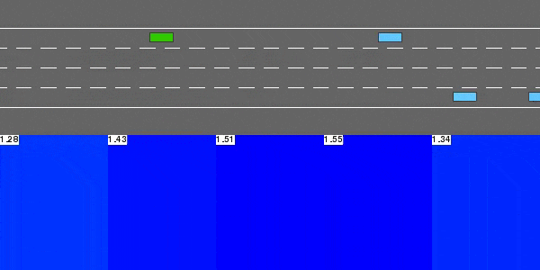
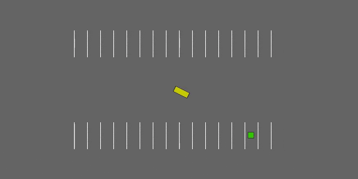
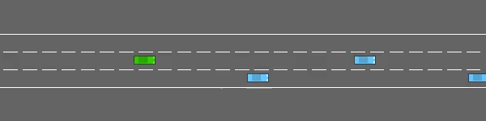
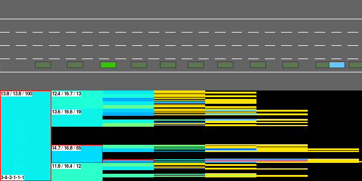

# clifter_highway


[](https://saweria.co/slowy07)


environment decision making in autonomous driving

**test online**
[](https://colab.research.google.com/drive/1owsJCTwjg92_2J0WDE-f-s_8jNvN9lgb?usp=sharing)


## environment

**highway**


in this task, the ego vehicle is driving in multilane highway populated with other vehicle. the agent's objective is to reach high speed whole avoiding collision with neighbouring vehicles. driving on the right side of the road is also rewarded
```python
environ = gym.make("highway-v0")
```


**merge**


in this task, the ego vehicle starts on a main highway but soon approaches a road junction with incoming vehicles on the access ramp. the agent's objectiove is now to maintain a higha speed while making room for the vehicles so that the can safety merge in the traffic.

```python
environ = gym.make("merge-v0)
```


**roundabout**


in this task, the ego vehicle if approaching a rounadbout with flowing traffic. ot follow its planned route automatically, but hash to handle lane changes and longitudinal control to pass the roundabout as fast as possible while avoiding collisions.


```python
environ = gym.make("roundabout-v0")
```


**parking**

a goal conditioned continuous control task in which the ego vehicle must pak in a given space with the appropriate heading.

```python
environ = gym.make("padking-v0")
```


**intersection**

intersection negotation task with dense traffic


**racetrack**

a continuous control task involving lane-keeping and obstacle avoidance


## example agents

**deep q network**



this model-free value-based reinforcement learning agent performs Q-learning with function approximation, using a neural network to represent the state-action value function Q.

**deep deteministic policy gradient**


this model-free policy-base reinforcemetn learning agent is optimized directly by gradient ascent. it uses hindsight experience replay to efficiently learn how to solve a goal-conditional taks.



**value iteration**


the value iteration is only compatible with finite discrete MDPs, this simplified state representation describe the nearby traffic in terms of predicted time-to-collision on each lane of the road.the transition model is simplistic and assumes that each behicle will keep driving at a constan speed without changing the lines. this model bias can be source of mistakes.

the agent then performs a value iteration to computer the corresponding optimal state-value function.

**monte carlo tree search**

the agents leverages a transition and reward models to perform a stochastic tree seach of the optimal trajectory. no particular assumption is required on state representation or transition model.




more information:
- [observation](documentation/observation.md)
- [actions](documentation/actions.md)