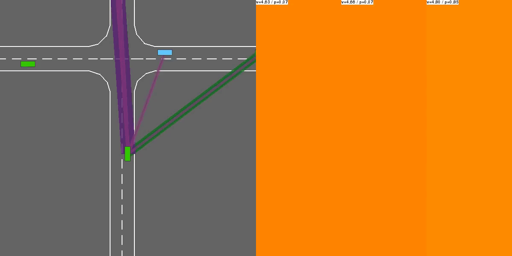

# clifter_highway


[](https://saweria.co/slowy07)

Autonomous driving decision making tasks and environments

</br>

## Try it online!

[](https://colab.research.google.com/drive/1owsJCTwjg92_2J0WDE-f-s_8jNvN9lgb?usp=sharing)



</br>

## Environments

**Highway**


In this task, the ego vehicle is driving in multilane highway populated with other vehicles. The agent's objective is to drive in high speed on the right side on the road while avoiding collision with other vehicles.
```python
environ = gym.make("highway-v0")
```


**Merge**


In this task, the ego vehicle approaches a junction with incoming vehicles on the access ramp. The agent's objective is now to maintain a high speed while leaving some space for other vehicles so that the ego vehicle can safely merge in the traffic.

```python
environ = gym.make("merge-v0)
```


**Roundabout**


In this task, the ego vehicle approaches a rounadbout with flowing traffic. It follows its planned route automatically, but also has to handle lane changes and longitudinal control to pass the roundabout as fast as possible while avoiding collisions.


```python
environ = gym.make("roundabout-v0")
```


**Parking**

A goal-conditioned continuous control task in which the ego-vehicle must park in a given space with the appropriate heading.

```python
environ = gym.make("parking-v0")
```


**Intersection**

Providing an intersection negotiation task with dense traffic for the ego vehicle.


**Racetrack**

A continuous control task involving lane-keeping and obstacle avoidance


</br>

## Example agents

**Deep Q-Network**


This model-free value-based reinforcement learning agent performs Q-learning with function approximation, using a neural network to represent the state-action value function Q.

**Deep Deterministic Policy Gradient**


This model-free policy-based reinforcement learning agent is optimized directly by gradient ascent. It uses Hindsight Experience Replay to efficiently learn how to solve a goal-conditioned task.


**value Iteration**


The Value Iteration is only compatible with finite discrete MDPs, so the environment is first approximated by a finite-mdp environment using env.to_finite_mdp(). This simplified state representation describes the nearby traffic in terms of predicted Time-To-Collision (TTC) on each lane of the road. The transition model is simplistic and assumes that each vehicle will keep driving at a constant speed without changing lanes. This model bias can be a source of mistakes.

The agent then performs a Value Iteration to compute the corresponding optimal state-value function.

**Monte-Carlo Tree Search**

This agent leverages a transition and reward models to perform a stochastic tree search (Coulom, 2006) of the optimal trajectory. No particular assumption is required on the state representation or transition model.


</br>

_More information:_
- [observation](documentation/observation.md)
- [actions](documentation/actions.md)
- [rewards](documentation/rewards.md)
- [multi agent setting](documentation/multi_agent_setting.md)
