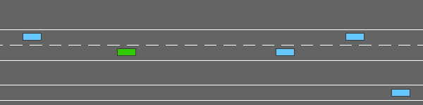

# clifter_highway


](https://saweria.co/slowy07)


environmetnt decision making in autonomous driving


## environment

**highway**


in this task, the ego vehicle is driving in multilane highway populated with other vehicle. the agent's objective is to reach high speed whole avoiding collision with neighbouring vehicles. driving on the right side of the road is also rewarded
```python
environ = gym.make("highway-v0")
```


**merge**


in this task, the ego vehicle starts on a main highway but soon approaches a road junction with incoming vehicles on the access ramp. the agent's objectiove is now to maintain a higha speed while making room for the vehicles so that the can safety merge in the traffic.

```python
environ = gym.make("merge-v0)
```



**roundabout**


in this task, the ego vehicle if approaching a rounadbout with flowing traffic. ot follow its planned route automatically, but hash to handle lane changes and longitudinal control to pass the roundabout as fast as possible while avoiding collisions.


```python
environ = gym.make("roundabout-v0")
```


**parking**

a goal conditioned continuous control task in which the ego vehicle must pak in a given space with the appropriate heading.

```python
environ = gym.make("padking-v0")
```


