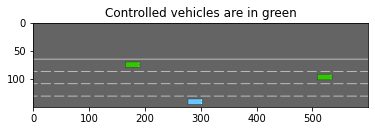
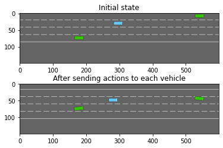

# multi agent setting

most environment can be configured to a multi agent version

## incrase the number of controlled vehicle

to that end, update the ``environment configuration`` to incrase ``controlled_vehicle``

```python
import gym
import clifter_highway

environ = gym.make("highway-v0")
environ.seed(9)

environ.configure({
    # two controlled vehicles
    "controlled_vehicles": 2
})
environ.configure({
    #  a single other vehicle
    "vehicles_count": 1
})

from matplotlib import pyplot as plt
%matplotlib inline
plt.imsho(environ.render(mode="rgb-array"))
plt.title("controlled vehicles are in green")
plt.show()
```



## change the action space

right now, since the action space has not ben changed, only the first vehicles in controlled by ``environ.step(action)``. in order for the environment to accept a tuple of actiions, its actions type must be set to ``MultiAgentAction`` the type of actions contained in the tuple must be descrob by a standard ``action configuration`` in the ``action_config``

```python
environ.configure({
    "action":{
        "type": "MultiAgentAction",
        "action_config":{
            "type": "DiscreteMetaAction",
        }
    }
})
environ.reset()

_, (ax1, ax2) = plt.subplot(nrows=2)
ax1.imshow(environ.render(mode="rgb_array"))
ax1.set_title("initial state")

# make the first vehicle change to the left
# and the second one to the right
action1,action_2 = 0, 2
environ.step((action_1, action_2))

ax2.imshow(environ.render(mode="rgb_array"))
ax2.set_title("after sending action the each vehicle")
plt.show()
```



## change the observation space

In order to actually decide what ``action_1`` and ``action_2`` should be, both vehicles must generate their own observations. As before, since the observation space has not been changed no far, the observation only includes that of the first vehicle.

In order for the environment to return a tuple of observations – one for each agent –, its observation type must be set to **MultiAgentObservation** The type of observations contained in the tuple must be described by a standard observation configuration in the ``observation_config`` field.

```python
environ.configure({
    "observation":{
        "type": "MultiAgentObservation",
        "observation_config":{
            "type": "kinematics"
        }
    }
})
obs = environ.reset()

import pprint
pprint.pprint(obs)
```

## wrapping up

```python
# multi agent environment configureation
environ.configure({
    "controlled_vehicles": 2,
    "observation":{
        "type" : "MultiAgentObservation",
        "observation_config":{
            "type": "kinematisc"
        }
    }.
    "action":{
        "type": "MultiAgentAction",
        "action_config": {
            "type" : "DiscreteMetaAction",
        }
    }
})

# dummy rl algorithm

class Model:
    def predict(self, obs):
        return 0
    
    def update(
        self,
        obs,
        action,
        next_obs,
        reward,
        info,
        done
    ):
        pass

model = Model()

# get training episode

obs = environ.reset()
done = False
while not done:
    action = tuple(mode.predict(obs_i) for obs_i in obs)
    next_obs, reward, info, done = environ.step(action)

    for obs_i, action_i, next_obs_i in zip(obs, action, next_obs):
        model.update(obs_i, action_i, next_obs_i, reward, info, done)
obs = next_obs
```

