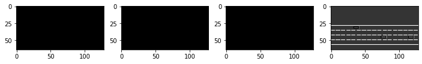
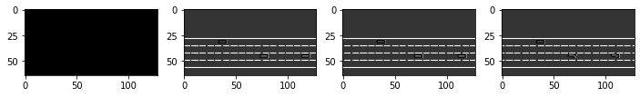

# Observation

for all environments, several types of a observation can be used. they are defined in the ``observation`` module. each environment comse with a __default__ observation, which can be changed or customised using environment configuration for instance

```python
import gym
import clifter_highway

env = gym.make("highway-0")
env.configure({
    "observation":{
        "type": "OccupancyGrid",
        "vehicles_count": 15.
         "features": ["presence",  "x", "y", "vx", "vy", "cos_h", "sin_h"],
         "features_range":{
            "x": [-100, 100],
            "y": [-100, 100],
            "vx": [-20, 20],
            "vy": [-20, 20]
         }
        "grid_size": [[-27.5, 27.5], [-27.5, 27.5]],
        "grid_step": [5, 5],
        "absolute": False
    }
})
env.reset()
```
the ``type`` field in the observation configuration takes values defined in ``observation_factory()``

## kinematics

the ``kinematicsObservation`` is a V x F array that describes a list of V nearby vehicles by a set of features of size F, listed in the "features" configuration field.

**example configuration**
```python
import gym
import clifter_highway

config = {
    "observation": {
        "type": "Kinematics",
        "vehicles_count": 15,
        "features": ["presence", "x", "y", "vx", "vy", "cos_h", "sin_h"],
        "features_range": {
            "x": [-100, 100],
            "y": [-100, 100],
            "vx": [-20, 20],
            "vy": [-20, 20]
        },
        "absolute": False,
        "order": "sorted"
    }
}
env = gym.make("highway-v0")
env.configure(config)
obs = env.reset()
print(obs)
```


## grayscale image

the ``grayscaleObservation`` is a W x H grayscale image of the scene, where ,W, H are et with the ``obsservation shape`` parameter. the RGB to grayscale conversion is weighted sum, configured by the ``weights`` paramter. several images can be stacked with the ``stack_size`` paramter, as is customary with the image observations.

**example configuration**

```python
from matplotlib import pyplot as plt
%matplotlib inline
config = {
       "observation": {
           "type": "GrayscaleObservation",
           "observation_shape": (128, 64),
           "stack_size": 4,
           "weights": [0.2989, 0.5870, 0.1140],  # weights for RGB conversion
           "scaling": 1.75,
       },
       "policy_frequency": 2
   }
   env.configure(config)
   obs = env.reset()

_, axes = plt.subplots(ncols=4, figsize=(12, 5))
   for i, ax in enumerate(axes.flat):
       ax.imshow(obs[i, ...].T, cmap=plt.get_cmap('gray'))
   plt.show()
```


**illustration of the stack mechanism**

we ilustrate the stack update by performing three steps in the environment

```python
for _ in range(3):
    obs, _, _, _ = env.step(env.action_type.actions_indexes["IDLE"])

    _, axes = plt.subplots(ncols=4, figsize=(12, 5))
    for i, ax in enumerate(axes.flat):
        ax.imshow(obs[i, ...].T, cmap=plt.get_cmap('gray'))
plt.show()
```

